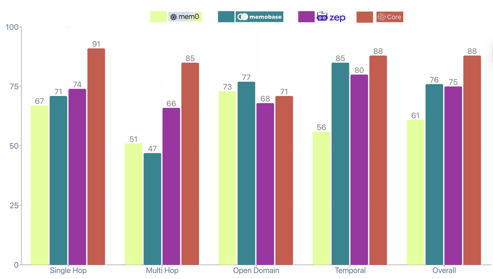

# Core Memory System Benchmark

A comprehensive evaluation framework for the **CORE** using the LOCOMO benchmark. This repository allows anyone to reproduce our benchmark results and compare their own memory systems against Core's performance.

## 🏆 Benchmark Results

Core demonstrates strong performance across all question categories in the LOCOMO evaluation:

- **Single Hop Questions**: 91% accuracy
- **Multi Hop Questions**: 85% accuracy
- **Open Domain**: 71% accuracy
- **Temporal**: 88% accuracy
- **Overall Average**: 85% accuracy



_Comparison with other memory systems (mem0, memobase, zep) shows Core's consistent high performance across all categories._

## 🚀 Quick Start

### Prerequisites

- Node.js 16+
- OpenAI API key
- Core memory system running (or your own memory system API)

### Installation

```bash
git clone https://github.com/RedPlanetHQ/core-benchmark.git
cd core-benchmark
npm install
```

### Configuration

```bash
cp .env.example .env
```

Edit `.env` with your settings:

```env
# OpenAI API Configuration
OPENAI_API_KEY=your_openai_api_key_here

# Core Memory System API
API_KEY=your_core_api_key
BASE_URL=http://localhost:3033
```

### Ingest Conversations

Before running evaluations, you need to ingest the LOCOMO conversations into your memory system:

```bash
node locomo/ingest_conversations.js
```

This will:

- Load conversations from `locomo/locomo10.json`
- Send conversation data to your memory system's `/api/v1/ingest` endpoint
- Track ingestion progress to avoid duplicates
- Prepare your memory system for evaluation

### Run the Benchmark

```bash
npm run evaluate
```

This will evaluate your memory system against the LOCOMO dataset and output detailed performance metrics.

## 📊 What This Benchmark Tests

The LOCOMO benchmark evaluates memory systems across four critical dimensions:

### Single Hop Questions (91% - Core)

Direct factual recall from conversation history.

```
Q: "What restaurant did Sarah recommend?"
Expected: "Chez Laurent"
```

### Multi Hop Questions (85% - Core)

Complex reasoning across multiple conversation turns.

```
Q: "Based on the budget discussion, what's the revised timeline?"
Expected: "Pushed to Q3 due to 30% budget cut"
```

### Open Domain Questions (71% - Core)

Questions requiring both memory and general knowledge.

```
Q: "What are the risks of the approach they discussed?"
Expected: "Market volatility and regulatory changes"
```

### Temporal Questions (88% - Core)

Time-sensitive queries and chronological reasoning.

```
Q: "What happened after the client meeting last Tuesday?"
Expected: "Sent revised proposal on Wednesday"
```

## 🔧 How It Works

### 1. Memory Integration

The benchmark integrates with your memory system via standard APIs:

```javascript
// Search for relevant context
const searchResults = await searchService.search(question, userId, {
  limit: 20,
  scoreThreshold: 0.7,
});

// Generate answer using retrieved context
const answer = await makeModelCall(messages, context);
```

### 2. Evaluation Process

Each question goes through:

1. **Context Retrieval**: Search memory for relevant information
2. **Answer Generation**: LLM generates response using context
3. **Intelligent Scoring**: Compare against gold standard using LLM evaluation
4. **Performance Metrics**: Calculate accuracy, retrieval rates, and error analysis

### 3. LLM-Based Evaluation

Instead of simple string matching, we use GPT-4 for intelligent evaluation:

```
"Generated answer contains sufficient matching content with gold standard"
→ CORRECT (Match ratio: 0.85)
```

## 🏗️ Architecture

```
core-benchmark/
├── locomo/                 # LOCOMO dataset and evaluation scripts
│   ├── evaluate_qa.js     # Main evaluation orchestrator
│   └── evals/             # Evaluation results
├── services/              # Core evaluation services
│   ├── qaService.js       # Question answering pipeline
│   ├── evaluateService.js # LLM-based answer evaluation
│   └── search.server.js   # Memory system integration
└── lib/                   # Utilities and model integration
```

## 🔀 Using Your Own Memory System

### API Requirements

Your memory system needs these endpoints:

```bash
# Search/retrieval endpoint
POST /api/v1/search
{
  "query": "search query here"
}

# Response format (flexible - we'll adapt)
{
  "results": ["context1", "context2"],
  "episodes": ["episode1", "episode2"],
  "facts": [{"fact": "...", "validAt": "..."}]
}
```

### Configuration Steps

1. **Update Search Integration** (`services/search.server.js`):

```javascript
async search(query, userId, options = {}) {
  const response = await this.axios.post('/api/v1/search', {
    query: query,
    // Add your system's specific parameters
    userId: userId,
    ...options
  });

  // Adapt response format for your system
  return {
    episodes: response.data.results || [],
    facts: response.data.facts || []
  };
}
```

2. **Set Your API Endpoint**:

```env
BASE_URL=https://your-memory-system.com
API_KEY=your_api_key
```

3. **Run Evaluation**:

```bash
npm run evaluate
```

## 📈 Understanding Results

### Output Files

- `evaluation_results.json`: Complete metrics and analysis
- `evaluation_locomo*.json`: Per-conversation detailed results
- Console: Real-time progress and summary statistics

### Key Metrics

- **Context Retrieval Rate**: How often relevant context was found
- **QA Success Rate**: Percentage of questions that received answers
- **Answer Accuracy**: Percentage of correct answers (LLM-evaluated)
- **Category Performance**: Breakdown by question type
- **Match Ratio**: Semantic similarity scores

### Sample Output

```
=== CORE MEMORY SYSTEM RESULTS ===
Total questions: 1,247
Questions with retrieved context: 1,189/1,247 (95.3%)
Questions with generated answers: 1,205/1,247 (96.6%)
Correct answers: 1,025/1,205 (85.1%)

=== CATEGORY BREAKDOWN ===
Single Hop: 245/269 (91.1%)
Multi Hop: 156/184 (84.8%)
Open Domain: 287/405 (70.9%)
Temporal: 337/384 (87.8%)
```

## 🚀 Advanced Usage

### Custom Dataset

Replace `locomo/locomo10.json` with your own conversation data:

```json
[
  {
    "qa": [
      {
        "question": "What did Alice order for lunch?",
        "answer": "Caesar salad with chicken",
        "evidence": "Conversation excerpt supporting this answer",
        "category": 1
      }
    ]
  }
]
```

### Batch Processing

Adjust batch size for your system's capabilities:

```javascript
// In evaluate_qa.js
const batchSize = 15; // Reduce for rate-limited APIs
```

### Custom Evaluation Prompts

Modify evaluation criteria in `services/evaluateService.js`:

```javascript
const evaluationPrompt = `
Your custom evaluation criteria here...
Be generous with time format differences...
Focus on semantic similarity over exact matching...
`;
```

## 🤝 Contributing

We welcome contributions to improve the benchmark:

1. **New Question Categories**: Add specialized evaluation criteria
2. **Memory System Integrations**: Support for more memory APIs
3. **Evaluation Improvements**: Enhanced scoring mechanisms
4. **Performance Optimizations**: Faster evaluation pipelines

## 📞 Support

- 🐛 **Issues**: [GitHub Issues](https://github.com/RedPlanetHQ/core-benchmark/issues)
- 📧 **Questions**: Create a discussion in the repository
- 📚 **Documentation**: Check our [Wiki](https://github.com/RedPlanetHQ/core-benchmark/wiki)

## 🏆 Leaderboard

Want to add your memory system to our benchmark comparison? Submit your results:

1. Run the full evaluation on the LOCOMO dataset
2. Share your `evaluation_results.json`
3. We'll add your system to the public leaderboard

Current standings:

1. **Core**: 85% overall accuracy
2. **Zep**: 75% overall accuracy
3. **Memobase**: 76% overall accuracy
4. **mem0**: 61% overall accuracy
